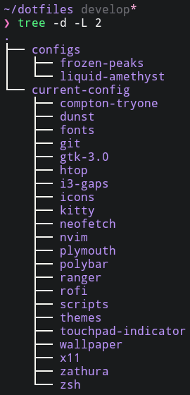

<h1 align="center">
    
	 
	<strong>
		adipopbv's dotfiles
	</strong>
	
 
		
		
		
		
		
	

	
 
		
		
	

</h1>

<h2 align="center"><i> Welcome to my (currently not so) charming dotfiles stash! </i></h2>

## Table of Contents:

- [Intro](#intro)
	- [TLDR](#tldr)
	- [What is a dotfile?](#what-is-a-dotfile?)
	- [Disclaimer](#disclaimer)
- [About](#about)
	- [Operating System](#operating-system)
	- [Notable Software](#notable-software)
	- [Dotman](#dotman)
	- [Configs](#configs)

## Intro

_Welcome friend... Welcome..._ This right here are the dotfiles for my current install.

Here you can find also some useful scripts and utilities I made and found across the internet. Check out each config's __scripts__ directory for them.

#### TLDR

- If you are looking for specific a **configuration**'s **documentation** or documentations in general, check out [the wiki](https://github.com/adipopbv/dotfiles/wiki).
- If you are looking for some nice **screenshots** check out [the gallery](https://github.com/adipopbv/dotfiles/wiki/Gallery).

#### What is a dotfile?

Well, to explain better, I have to go back in time. Bun not too much. Let me tell you a little story...

Once upon a time there was an operating system being developed: __UNIX__. Because in the unix world the current directory is `.` and the previous one is `..`, in an attempt to avoid listing them, all files starting with a __dot__ in front of the name were ignored, thus becomming hidden.

One day a user showed up and he wanted to have his apps behave in the way he wanted, so the mighty devs said:   
> Very well, you shall have means for customizing them apps.

So they made the settings of the apps accessible from files in each user's home directory and because they were so many, they were made hidden, not to disturb the user.

_The end!_

So basicaly a dotfile is a setting file for a program.

#### Disclaimer...

- **Some stuff might not work as intended**, therefore a backup is always a good idea...
- I know it's not perfect but I guess it's a good enough start.
- I am always **open to suggestions** but I might not have enough time to look into some stuff.
- I plan to add more stuff when I have more time, but for now this is all I got.

## About

#### Operating System:

Well, __Linux__ of course!   
__Arch Linux__ to be more specific. For now I plan to stick with it but maybe sometime when I'll have more time I'll switch to __Gentoo__. Who knows...

#### Notable software:

For now, some of the most important software I made custom configs for are the following:   
| Category | Program |
| --- | --- |
| Compositor | [compton](https://github.com/tryone144/compton) (tryone fork) |
| Notifications | [dunst](https://github.com/dunst-project/dunst) |
| Version Control | [git](https://github.com/git/git) |
| Window Manager | [i3-gaps](https://github.com/Airblader/i3) |
| Terminal Emulator | [kitty](https://github.com/kovidgoyal/kitty) |
| File Editor | [neovim](https://github.com/neovim/neovim) |
| Status Bar | [polybar](https://github.com/polybar/polybar) |
| File Explorer | [ranger](https://github.com/ranger/ranger) |
| App Launcher | [rofi](https://github.com/davatorium/rofi) |
| Terminal Shell | [zsh](https://github.com/zsh-users/zsh) |

#### Dotman:

So... Let me explain my mentality.

- The dotfiles repo is like an archive of multiple `configs`, located in the `configs` dir.   
	- Each `config` is basicaly a dir with configuration files for some programs.
	- There can be any number of `configs`, each with configurations for different programs, colorschemes, bindings etc.
- There is a `current-config` dir which has the currently stored config files, symlinked to the needed paths.
	- The `current-config` is separated from all other `config`, it is a stand-alone configuration that is not saved by git.

Here does the mighty __Dotman__ utility come in:
- Dotman is taking care of customizations management.
	- It can list avalilable configs
	- It creates new configs from the current one
	- It sets configs
	- And for now that's all... In the future it might even install and uninstall packages and set up a freshly installed system.
- I might release dotman as a full utility program at some point, but for now it's only a script based on GNU's [stow](https://www.gnu.org/software/stow/).

#### Configs

Each config is a (mostly) unique mashup of programs, colorschemes, bindings, scripts and more.

Check out the [wiki](https://github.com/adipopbv/dotfiles/wiki) for a full documentation of the configs.

